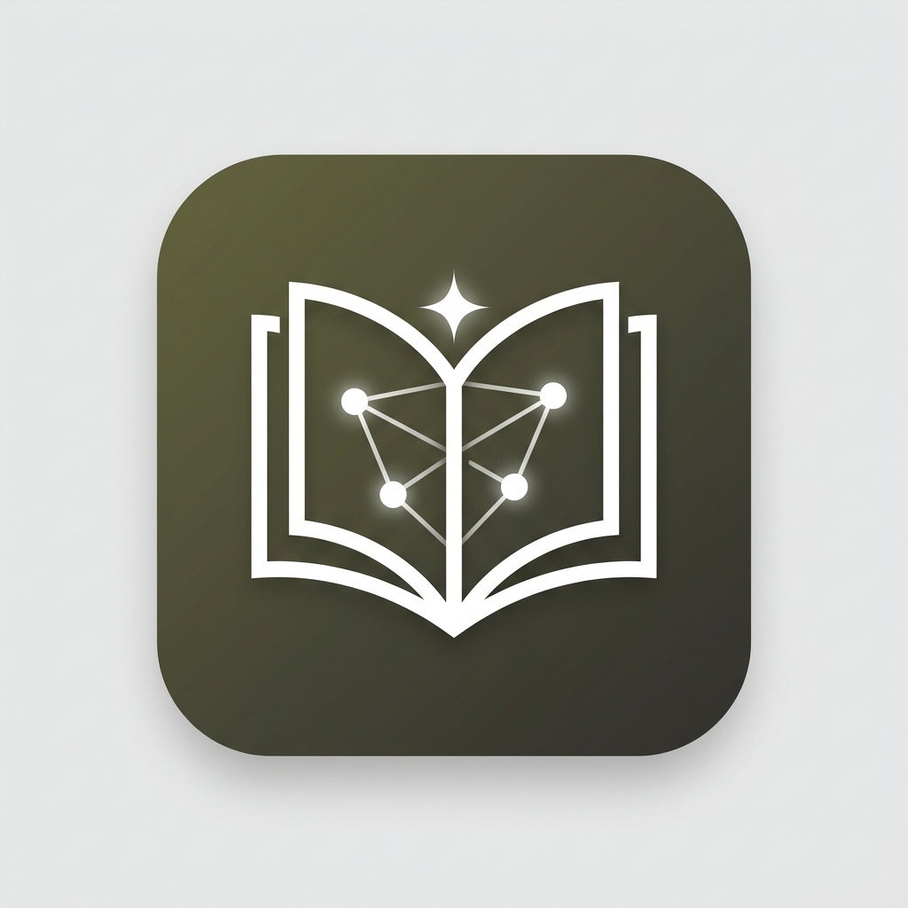

# Studious AI 📚

> AI-powered student study workspace — notes, drawing, flashcards, and a built-in browser. All in one desktop app.



## Features

- ✍️ **Rich text notes** with formatting
- 🎨 **Drawing canvas** for handwritten notes
- 🧠 **AI prompt helpers** — summarize, flashcards, quiz, explain
- 🌐 **Built-in split-screen browser** (Electron only) — open ChatGPT, Claude, YouTube without leaving the app
- 📁 **Folder organization** with Zustand persistence
- 📤 **Export** notes as PDF, Markdown, or plain text
- 📱 **PWA support** — install on Android/iOS/tablet from browser

## Tech Stack

- **React + TypeScript + Vite**
- **Tailwind CSS v3**
- **Electron** (desktop app with native BrowserView)
- **Zustand** (local persistence)
- **react-resizable-panels** (split-screen layout)

## Getting Started

### Prerequisites
- Node.js 18+
- npm 9+

### Install dependencies
```bash
npm install
```

### Run in development (Electron)
```bash
npm run electron:dev
```

### Run in browser (PWA dev)
```bash
npm run dev
```

## Build

### Linux (AppImage + deb)
```bash
npm run electron:build:linux
```

### Windows (exe installer)
```bash
npm run electron:build:win
```

### macOS (dmg)
```bash
npm run electron:build:mac
```

### PWA (for web / mobile / tablet)
```bash
npm run pwa:build
# Then drag dist/ to netlify.com/drop
```

## Icon Generation (first time setup)

```bash
npm install --save-dev sharp
# Place your 1024×1024 PNG at assets/icon-source.png
node scripts/generate-icons.mjs
```

## License

MIT
